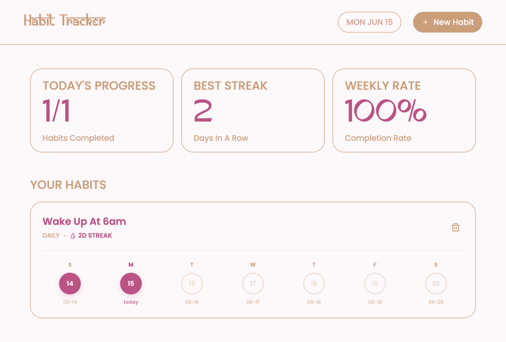

# Habit Tracker
A small webapp to track your habit.

## tech stack:
- html
- css
- javascript

## Functions:
- responsive
- minimalist
- simple
- clean
- works
- tracks habbit
- stores it in local storage
- date

## view site:
- search [https://habit-track-rojen.netlify.app/](https://habit-track-rojen.netlify.app/)

or

- clone the [https://github.com/rojen-chakradhar/habit-tracker](https://github.com/rojen-chakradhar/habit-tracker) repo
- open the folder in your ide
- get the webapp in your device.

i used antigravity, and claude to get make the webapp have nepali date also, but the code it gave me didnt work, but it did help me to make this work a lil.